# Neuropil Verification With Cryptographic Tool

We already know about neuropil architecture from its official [website](https://neuropil.org) . It's time for confirmation now. A cryptography tool will now analyze the messages.Verifpal is our preferred cryptographic tool. It is quite easy to use. Therefore, the architecture of the neuropil are easily understood by non-professionals Additionally, the result  is clear and well-defined. Following the analysis, the audience will be able to learn about the security properties of the protocol. The sequence states that every message is checked separately.

The argument is about secured communication with the neuropil protocol. It has been said that the protocol provides authentication at every step. Its final goal is to generate an encrypted, secure connection between identities. To verify the claim, we will implement a verification tool to define data in every step of communication, addressing as scenario. In these scenarios, we consider identities as Alice, Bob,Carl , Della, and so on. They are connected through their own nodes called NA,NB,NC, ND etc. 

----------

## Handshake Message

>***Scenario***

The first message is transmitted for handshaking. The nodes in the network exchange their initial information through a node token. Hence, we introduce two nodes, NA and NB. They exchange handshake messages to identify their individuality.

Initially, they knew their private keys, na and nb. From these private keys, the public keys gna and gnb are generated. Generally, a handshake token contains a public key, hostname, and port number in the subject field, and the rest of the fields are empty. We use those values to define the token and put them together.
in “data” and “messg" consecutively for NA and NB using "CONCAT" algorithms. Applying the SIGN algorithm with data and a private key (na or nb), nodes generate their signatures (sign_NA,sign_NB). They exchange their "data" and "messg" with their signature.

>*******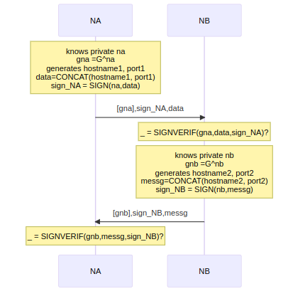*******

When NB receives the digital signature of NA (sign_NA) according to the fig., it verifies the value with the public key. For verification, it processes sign_NA with NA’s public key (gna) and data by implementing the "SIGNVERIF" algorithm.
Same way NB's signature sign_NB is verified by using "messg" and "gnb". Through the queries, we ask Verifpal to analyze the model.

 

>***Queries and Result Of Handshake Message***
 

***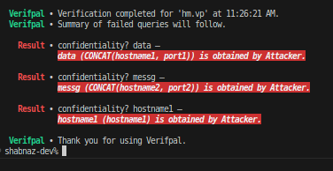***

>***1. Authentication ? NA->NB: sign_NA***
Result: The message maintains its authentication because it contains a signature. So the attacker couldn’t change anything in the message; otherwise, the signature would be broken. The Recipient will realize and drop the message.

>***2.Authentication ? NB->NA: sign_NB***
Result: Same explanation is applicable for NB. So authentication is ensured in this message

>***3. Confidentiality? data***
Result : Since the Handshake message is transmitted as plaintext , the attacker is able to see the token. As data is represented the handshake token , so it is obtained by  attacker

>***4. Confidentiality ?messg***
Result: "data” is the handshake of NA, and “messg” is NB’s. So both are obtained by the attacker, but he can’t modify them; otherwise, signatures (sign_NA and sign_NB) will be broken. The opposite node will understand and drop the message.

>***5. Confidential ? hostname1***
Result: Every entity in the network can see the handshake token and its components. hostname is part of the subject in the handshake token. so it is also obtained by the attacker.

----
## Join Message

Identity and node tokens are both contained in the join message. Identity in this case refers to Alice.Identity and his linked node have known each other's token with signature from the beginning. 
 

>******

>***Scenario*** 

1.Alice and NA know the node token (nt), it (identity token), and the node's signature (sa). So they generate each other's fingerprints due to the compatibility of the Verifpal tool. Since both tokens are sent by a message, they have knowledge about nonce c1.

2.Alice generates own public key and  the fingerprint of NA.

3.Node NA calculates a public key gna from private key na.

4.NB has computed his public key gnb.

5.From the [handshake](#handshake-message) message both  nodes know each other's public key gna,gnb.

6.Identity and node share a secure connection, i.e., symmetric communication( not in real-life communication). Alice generates the signature js1 with the node fingerprint “nfp” and concatenation message. The message consists of the public key GA and signature js1 and node fingerprint nfp. It is a replica of the identity token of the join message. She sent the symmetric message j0 to NA.

7.Node NA calculates a secret key from node NB’s public key and encrypts the Alice-decrypted message j0_de  with the secret key "s" and sends it.

8.After receiving j1, NB uses the calculated secret key "s1" to decrypt.  After splitting the concat message, he uses her public key to confirm the signature..

9.Here, the join message is broken down into two halves to better understand the message component. The identity token is carried by the first part, and the node token is carried by the second. However, in order to identify them as messages, two messages share the same nonce value, "c1." Thus, NA delivered join message j2's second part.The identity fingerprint ifp's hash value is used to create the node's signature on the message. The concat message, which is created using Alice's fingerprints and signatures, is then encrypted.

10.The second portion of the message was found. After decryption, NB found the signature js2_, which is structured with the identity fingerprint "ifp" and private key na. NB verifies the signature with a public key.

>***Queries and Result***

Now Verifpal analyze the model according to security parameters that are asked by  query section.

>***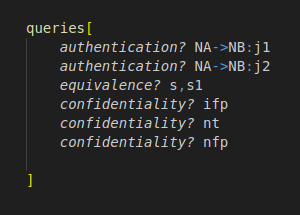***

>

>***1.Authentication? NA->NB: j1***

Result: The first part of the join message is j1, which is transmitted from NA to NB. It carries signatures and fingerprints similar to [handshake](#handshake-message) message due to the fact that the message can't be modified by the attacker. Also, messages are encrypted, so they can be avoided from eavesdropping attacks.

>***2. Authentication? Na->NB: j2***

Result: "j2" is the second portion of the join message. It contains signatures generated from Alice's fingerprint. For signature and fingerprint, the recipient NB ensures the authentication of the join message. So there is no access from a third party. Otherwise, the result showed a red mark.

>***3. Equivalence? s,s1***

Result: The message follows symmetric encryption. So it is necessary to ask if the secret keys of both parties are equivalent or not. The long-lived secret key is computed from the opposite party's public key, which is part of the token, and signatures and fingerprints are generated from the token. So it is difficult for the adversary to exchange the handshake token public key with his own key.

>***4. Confidentiality? ifp***

Result: Here is asked about confidentiality the component of the message  i.e "ifp".So attacker can't decry the message so information are secured.

>***5. Confidentiality? nt***

Result: Even in the event that an attacker obtains nfp, the secrecy of the node token "nt" is also requested to be analyzed. However, "nt" remains secure due to its hash values.

>***6. Confidentiality? nfp***

Result: Node fingerprint "nfp" contains hash values. So attackers generally can't gain any information, even if they are able to obtain the message. 

But queries passed successfully, and the attacker didn't gain any information about the message.

----------------------------
## DHT

Messages from distributed hash tables are created to define connections between nodes. It typically includes the node's hash value.In this case, node NC connects to node NA by an update message,piggy message and so on. First sequence diagram shows the exchanging the key that is already explained in Handshake message.  
 

>***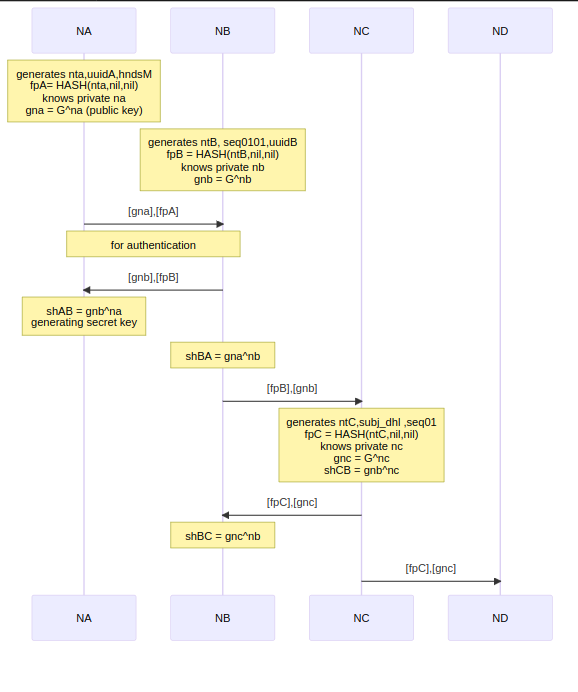***

 

The update message "dht01" in the subsequent case is empty, containing only the hash values of the nodes which make up Node ND.It adheres to n2n encryption. 

>***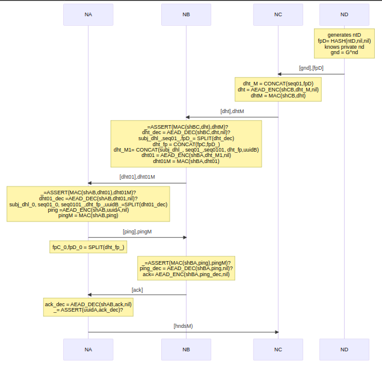***

>***Queries and Result***

Here is the verification of security parameters:

>***-1.png)***

 

>***Equivalence?shAB,shBA*** 

Initiator and recipient  are used same key. So the query is about equivalence of both side key. The result is proved that both are equal.  

>***Confidentiality?ack*** 

Through the confidentiality queries , the output shows that it is obtained by attacker.But Ack, ping,update messages are part of DHT messages that carries only hash value. Attacker can't gain original information from hash values.  

>***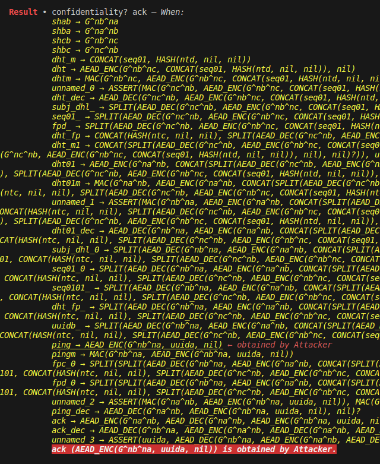***

>***Confidentiality?ping*** 

Ping message confidentiality is also demonstrated by the explanation provided in the ACK message.

>***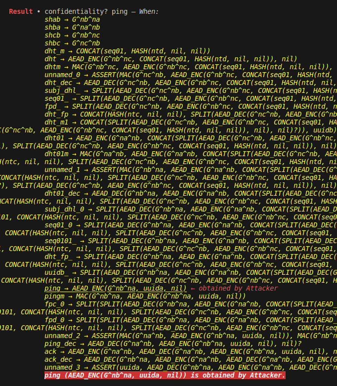***

>***Authentication?NB->NA : ack*** 

Verifpal tool doesn't provide any red alarm for this query. That means , Attacker can't break the authenticity of ACK message.

>***Confidentiality?uuidA***

Message carries UUID which is  unique.It is confidential and fresh. So  that means attacker couldn't access or modify the DHT message 

>***freshness?uuidA***

By this queries, it specified clearly that the message is maintained it confidentiality and freshness. 

>***Equivalence?uuidA,ack_dec*** 

The Tool guarantees the integrity of the message both before and after encryption, as it detects no security property loss during transmission.

-------------------------------------------
## Pheromone Message

A pheromone message is transmitted in order to identify a match with a peer.This kind of routing technique finds the target as quickly as possible.It contains fragrances and bloom filters' hash value.

The message "m1" that contains the hash values of the sub (taking identity produced subject into consideration) is pointed  in this figure.The message is distributed using every possible method.The same method was used to communicate the targeted identification. Node NC is found to be the shortest path to the goal in both messages.

>***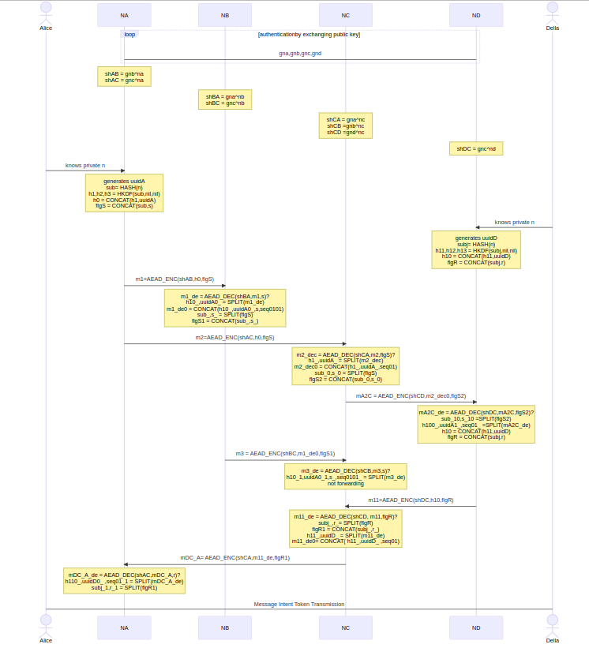***

>***Queries and Result***

Here the queries is used to verify the security object. The explanation is given with the result .

>******

>***Result***

>***Confidentiality? n*** 

The prime information "n" is conveyed by message m1, along with its hash value.An adversary cannot compromise its confidentiality while it is in transit.

>***equivalence? sub,subj***

The hash value of "n" is used to reform sub and subj. Analysis reveals no flaws in the result.it implies that both are the same.

>***Confidentiality? h11***

Scent that is generated from the hash value of "n" is regarded as "h11".According to the result, the attacker obtains the h11 but is unable to modify it.Since "n" maintains its secrecy, the hash value is also protected. 

>***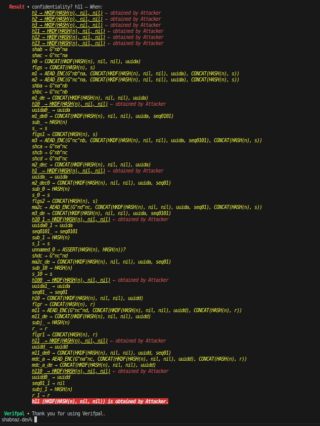***

   

>***Confidentiality? mDC_A***

Attacker obtains the message "mDC_A". However, it contains h1, which like h11, is generated from a hash value of "n". An attacker cannot obtain any information because it contains a hash value. 

>***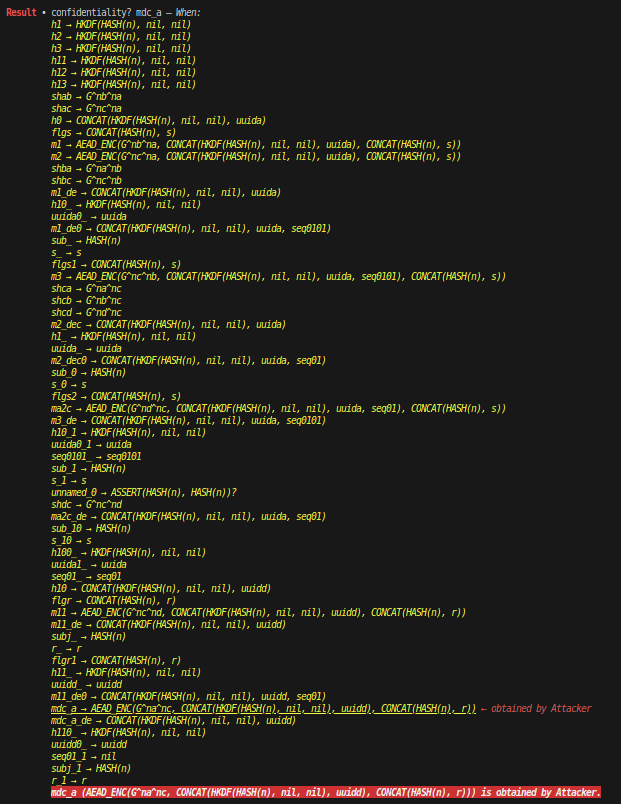***

>***equivalence?h1,h110***

Both the initiator's h1 and the recipient's h110 are equivalent.Therefore, it remains unaltered throughout transmission. The attacker can only view the message; they can't to alter it. 

>***authentication? NC->ND:mA2C***

Attacker can't break the authentication of message "mA2C".

>***equivalence? h100,h11***

The explanation of h1 and h110 is also applicable here.

>***equivalence? uuidA0_,uuidA0_1***

During transmission uuidA0_,uuidA0_1 are same .that means third party didn't have access of message.

>***confidentiality? uuidA0***

The outcome demonstrates about uuidA0's secrecy. A portion of message mA2C is uuidA0.If internal values are secure, the message is kept confidential."uuidA0" is protected so, Attacker can't break the confidentiality of message mA2C.

>***equivalence? h10_1,h1_***

The explanation of h1 and h110 is also applicable here.

>***equivalence? subj,sub_10***

The explanation of h1 and h110 is also applicable here.

-------------------------------------

##  Message Intent Token

The MIT is transmitted with the hash value of the pheromone message  [pheromone](#pheromone-message) subject "sub" after the peers are detected to match.they exchange their signature through MIT.

In the diagram, Della sends Alice a message called msg1, which includes information like as the subject's hash value, ND's fingerprint, and identity signature.Alice checks the signature for authenticity after receiving the message.

>***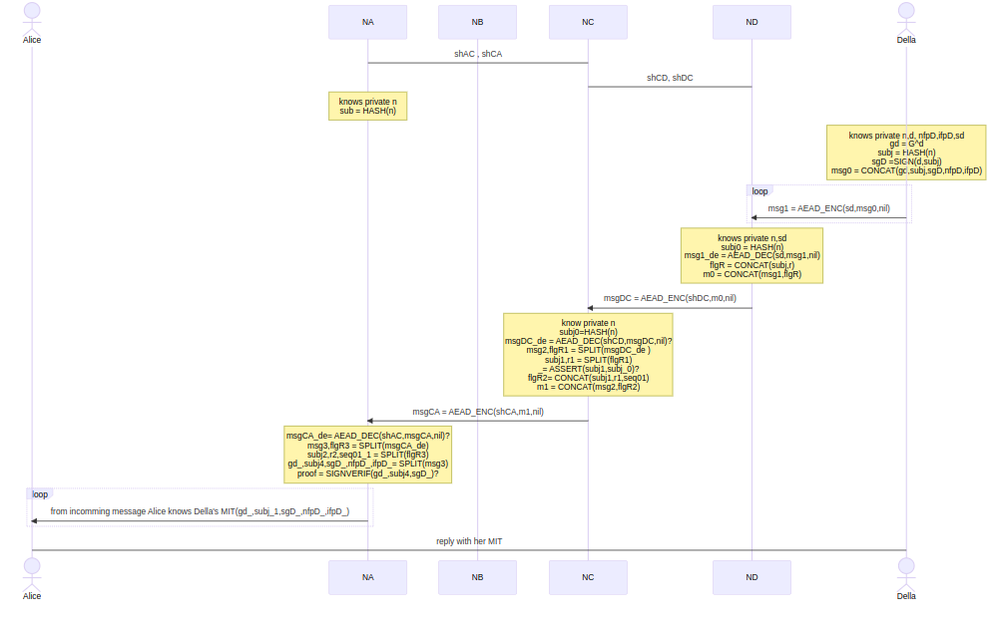***

>***Queries and Result***

>***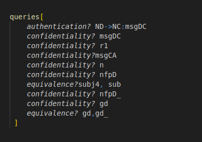***

>***Result***

>***authentication? Nd->Nc:msgDC***

The result indicates that the message "msgDC" originates from an authenticated identity .

>***confidentiality? msgDC***

The attacker obtains the message.It means it is no longer confidential.

>***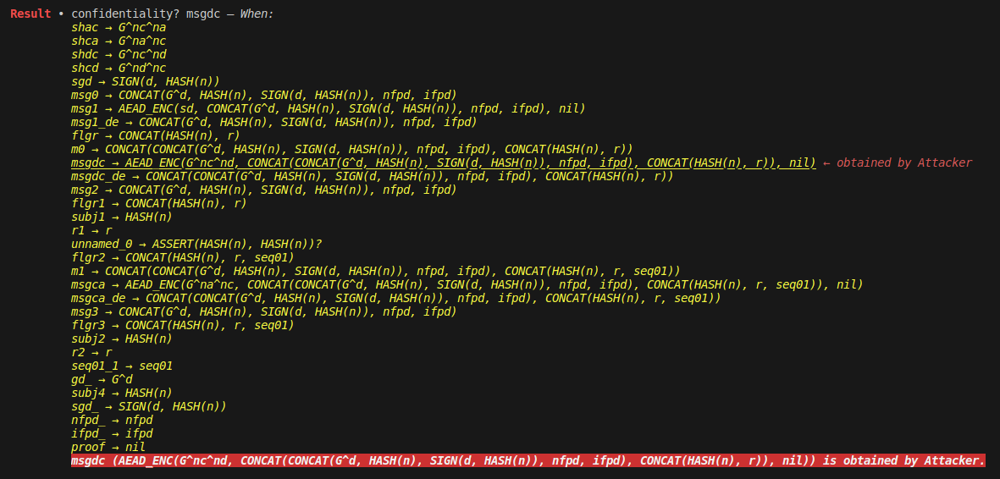***

>***confidentiality? r1***

One of msgDC's internal components is r1. "r1" are expected to be revealed at the same time as msgDC. However, the outcome reveals that r1 is still hidden. This indicates that the attacker can only view the message; they are unable to decrypt the message.

>***confidentiality?msgCA***

In the same way, Attacker obtains msgCA that contains n, nfpD, subj, sigD and so forth.

>***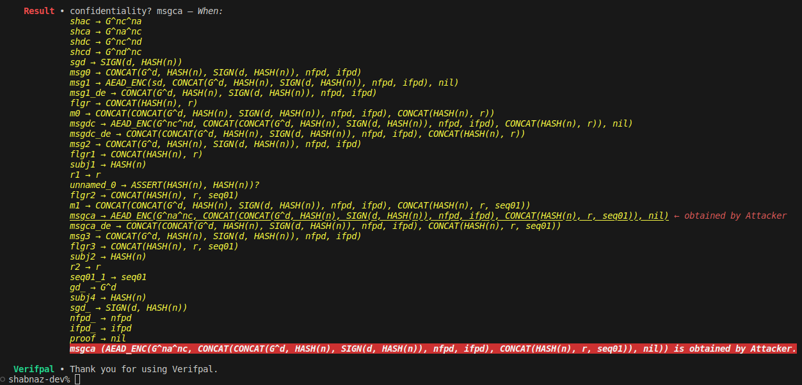***

>***confidentiality?n***
yes,Because n is used as hash value in the message.Since hash functions are irreversible, the hash value cannot be used to retrieve the original data. It is hidden and protected

>***confidentiality? nfpD***
It is also confidential because of hash values.

>***equivalence? subj4, sub***

Sending hash values of subject and receiving hash value are same.So During communication it remains unchanged.  

>***confidentiality? gd***

public key gd is hidden

>***equivalence? gd,gd_***

Della sending public key gd and Alice receiving public key from message "msgDC" are same.

n,nfp,gd are confidential information of msgDC. If attacker can access the message msgDC, the he can gain n,nfp,gd. but he can't, so the message is still undisclosed.

---------------------------------

## User Space Message

The intent of user-space message is about exchanging ephemeral key which is addressing as epk here

>***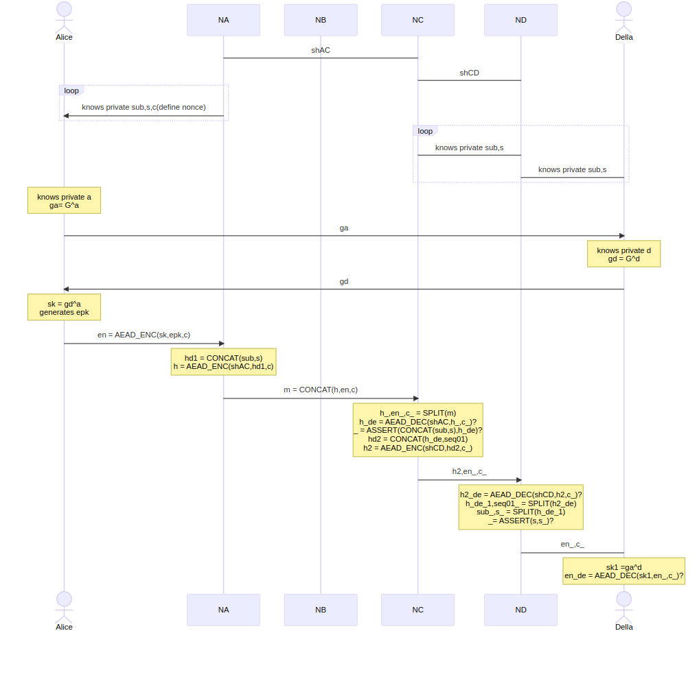***

>***Queries and Result***

>***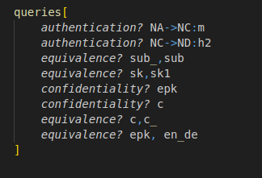***

>***Result***

>***authentication? NA->NC:m***

 na

>***authentication? NC->ND:h2***

Node NC delivers "h2" to node ND. Because it contains a hash value, h2's authentication is also preserved.

>***equivalence? sub_,sub ***

the queries about the equivalence between sending subject (sub) and receiving subject (sub_), both are equivalent

>***equivalence? sk,sk1 ***

The secret keys (sk,sk1) are same.

>***confidentiality? epk***

Through encrypted cipher text, the ephemeral key is transmitted.It is shown in the result that message achieves its confidentiality during transmission.

>***confidentiality? c ***

C is known as a nonce.It is not concealed and is typically sent as plain text. The attacker has access to the values.

>***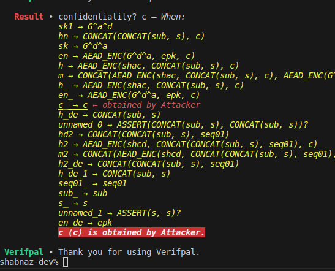***

>***equivalence? c,c_ ***

Sending nonce and receiving nonce are same

>***equivalence? epk,en_de***

After  decrypting the message en_, the ephemeral key that recipient receive from message and initiator transmitted ephemeral key are same . That means, message isn't modified  by attacker. 

-------------------------------

## E2EE with Multiple Receiver

The pheromone message subject exchange is followed by the establishment of the dedicated data channel. the remaining messages were still encrypted with two layers.An attacker would have an extremely hard time breaking the message.Long-term secret key and ephemeral key "epk" are used to encrypt confidential messages.

>***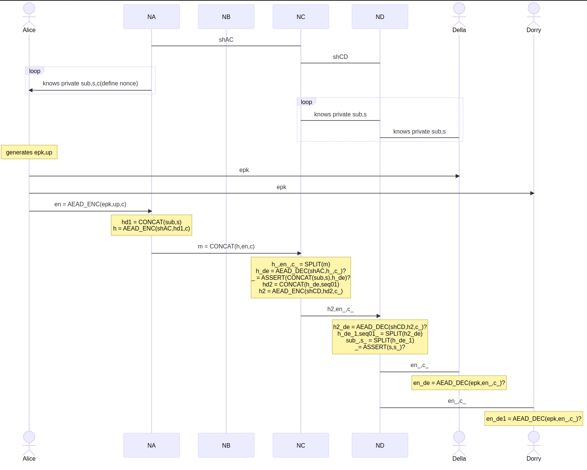***

>***Queries and Result***

----------------------------------------

>***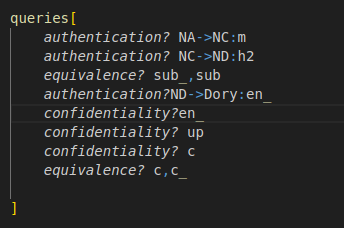***

>***Result***

>***authentication?NA->NC:m***

After the analysis tool confirms that the message "m" being transferred from node NA to NC is legitimate,

>***authentication?NC->ND:h2***

h2 is transmitted for node to node communication. During communication it ensures its authentication.

>***equivalence?sub_,sub***

The recipient receiving sub_ and the initiator sending topic "sub" remain the same.

>***confidentiality?c***

Nonce is presented by C; it transmits as plain text.Therefore, it upholds public values.

>***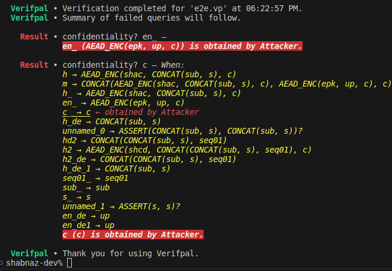***

>***equivalence?c,c_***

It  maintains its authenticity though it sends as a plain text. After reaching destination it remains unchanged.

>***confidentiality?en_***

The outcome indicates that the attacker gained en_.It is his responsibility to obtain the sensitive data.

>***confidentiality? up***

"Up" is the secret information that en_ carries.However, protection from attackers still exists.Therefore, if internal values are secured, the message will be secure."en_" is a protected message. 

In the end  The tool analysis results match the expected results, indicating that Neuropil maintains message authentication at every stage.The degree of security is not compromised while communicating.Therefore, the cipher text's two-layer encryption process will make it tough for the attacker to crack. In addition, it is a lightweight C library that is simple to implement. It works similarly to the MQTT protocol but concentrates on meeting all security requirements.