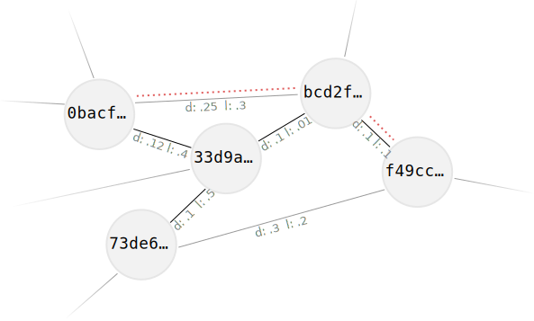
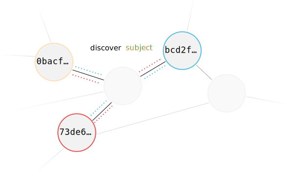
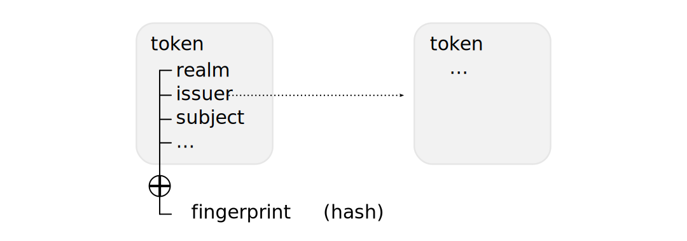
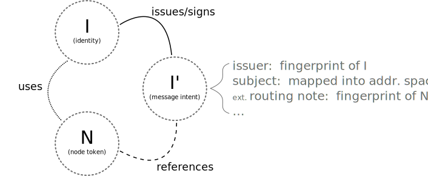

..
  SPDX-FileCopyrightText: 2016-2021 by pi-lar GmbH
..
  SPDX-License-Identifier: OSL-3.0

.. _core_concepts:

Core Concepts
=============

  *“All non-trivial abstractions, to some degree, are leaky.”*—Joel Spolsky

This chapter describes the intrinsic building blocks that make up neuropil. It
is intended to help readers gain a deeper understanding of neuropil’s internals
and its design, and ultimately make better use of the library.

The versatile concepts described in this chapter are primarily pervasive in the
implementation of the neuropil messaging layer itself, but curious users of
neuropil will most likely be exposed to them, eventually. After all, neuropil’s
user facing abstractions, such as :ref:`realms`, are constructed on top of
these building blocks. By nature, primitive concepts escape the abstractions
that contain them, and understanding them will demystify the real-world
behavior of neuropil applications.

.. NOTE::
   This introduction offers only an informal coverage of the foundations upon
   which neuropil is built. For an in-depth discussion we refer to the following
   papers:

   - `Tapestry: A Resilient Global-scale Overlay for Service Deployment
     <http://bnrg.cs.berkeley.edu/~adj/publications/paper-files/tapestry_jsac.pdf>`_
     by Ben Y. Zhao, Ling Huang, Jeremy Stribling, Sean C. Rhea, Anthony D.
     Joseph, and John Kubiatowicz (2004)
   - `Tapestry: An Infrastructure for Fault-tolerant Wide-area Location and
     Routing <http://oceanstore.cs.berkeley.edu/publications/papers/pdf/tapestry_sigcomm_tr.pdf>`_
     by Ben Y. Zhao, John Kubiatowicz, and Anthony D. Joseph (2001)

The Overlay Network
*******************

neuropil decouples routing from the physical network by implementing a
so-called *overlay network*. In this logical network, the physical network
addresses of nodes are mapped to randomly chosen, *virtual addresses* in a
256‑bit *address space*. This virtual address space is large enough that most
of it will never be used, and address collision is virtually impossible.

Any two addresses in the overlay network have a logical, relative *distance*,
taken into account by nodes to coordinate routing. Specifically, a node will
maintain connectivity to many nodes with virtual addresses close to itself, and
to fewer nodes whose virtual addresses that are far from it. Because it is possible
to tell which one of any two nodes is closer to a particular virtual address,
scalable, distributed routing can be achieved by forwarding messages to the
address closest to the destination. The node at that intermediary address will
either pass on the message to its destination, or again forward it to the next
closest node it knows, if any.

.. NOTE::
   As an additional property, latency is taken into account for routing
   decisions. By accounting for latency, inefficient routing topologies that
   fail to reflect the physical host network can be avoided.

A different, useful routing variant involves intentionally sending messages to
destination addresses that may not be occupied by any node at all. In this
variant, messages are not routed to their final destination, but to the node
that occupies the virtual address closest to the destination address. This
works because the node that is closest to any given address is unambiguous
across the overlay network .

neuropil uses this type of routing to allow nodes to automatically discover
each others virtual and physical addresses. Using a cryptographic hash
function, a *subject* string is mapped into the 256‑bit address space. The
nodes then “meet” at whichever node is currently the closest to this address,
and exchange their contact details by proxy. As a result, neuropil nodes need
not know the addresses of the nodes with which they will communicate in
advance, but can instead discover them dynamically on demand.

.. NOTE::
   neuropil employs multiple layers of end-to-end encryption so that they can
   participate in cooperative routing without risk of confidentiality or
   integrity being compromised.

Tokens
******

A *token*, sometimes specifically referred to as an *aaatoken*, is a record
that represents the nodes of a directed acyclic graph. It consists of a number
of predefined fields with conventional usage semantics, and can be extended
with a set of arbitrary, user-defined fields. Refer to :c:data:`np_token`
for the aaatoken structure definition and predefined fields, and to
:ref:`api-neuropil-attributes` for the API methods to interact with user defined attributes.

A token can be unambiguously referred to by its *fingerprint*, which is a
256‑bit hash value derived from all of its contents. Referencing a fingerprint
in one of the fields of a token creates an unambiguous, directed edge from that
token to another token. Conveniently, this fingerprint can also be used as a
virtual address in our overlay network.

.. NOTE::
   As a hint for readers who are familiar with JWT, neuropil’s token structure
   is loosely modeled after `JSON Web Tokens <https://en.wikipedia.org/wiki/JSON_Web_Token>`_.

neuropil defines three distinct types of tokens to implement its
authentication, authorization, and accounting (AAA) capabilities on top of its
overlay network.

*Node tokens* denote ephemeral key pairs used by nodes at the transport layer.
Their fingerprint is the virtual address of a node in the overlay network.
Whenever two nodes talk to each other, they use the public keys noted in each
others node tokens to secure the communications end-to-end.

*Identity* tokens denote relatively long-lived key pairs used by the entities
that sit on top of—or *use*—nodes. Identities are decoupled from nodes in a way
that allows them to communicate using multiple nodes, even at the same time.
Identities are used to restrict who accesses a given application, and are
possibly exchanged out of band. Messages from one identity to another are
secured end-to-end, on top of the secure node-to-node channels, using the keys
specified in their identity tokens.

*Message intent* tokens link nodes and identities together. They are signed by
an identity so that receivers of a message intent can authenticate it after
matching it to an identity they trust—i.e., the issuer of the message intent.
They also include a *routing hint* that contains the fingerprint of one of the
nodes in use by the identity. This fingerprint is also the virtual address of
the node to and from which messages will be sent. Finally, the *subject* field
in a message intent is used to discover nodes to exchange messages with via the
fuzzy routing technique described earlier. It is mapped into the virtual
address space of our overlay network, and signifies a channel over which
identities will communicate.

To summarize, users of neuropil must validate identity and message intent
tokens in their respective AAA callbacks according to the policies they desire
to implement. They do this by matching identity and message intent tokens with
identities they know and trust. Subsequently, they must take care of identity
management as well. Beyond that, neuropil ensures that data produced and
consumed by message handler callbacks remains authentic and confidential, and
transparently abstracts message routing.
