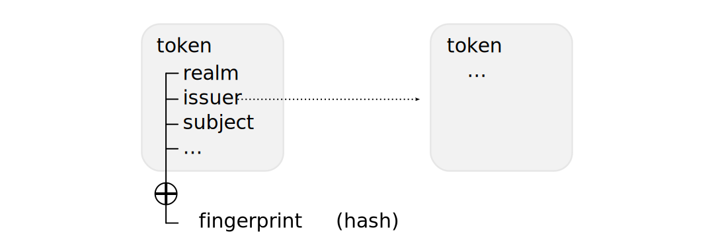

Realms, Identities, Tokens, and Signatures
==========================================

This chapter describes the intrinsic building blocks provided by Neuropil.
Instead of mandating a one-size-fits-all solution, Neuropil provides you with a
small set of versatile parts that can be used to implement a variety of
different trust models. These building blocks are used by applications built on
top of Neuropil, as well as internally to implement the messaging layer. To
master them means to find the right architecture for your domain-specific
problem.

Token
*****

A *token*, sometimes specifically referred to as an *aaatoken*, is a record
that represents nodes in a directed acyclic graph. It consists of a number of
predefined fields with conventional usage semantics, and can be extended with a
set of arbitrary, user-defined fields.

A token can be unambiguously referred to by its *token hash*, which is derived
from all of its contents. Referencing the hash of another token in one of its
field values creates an unambiguous, directed edge from one token to another.

- See :ref:`np_aaatoken_t` for the aaatoken structure definition and
  pre-defined fields
- See :ref:`np_tree_t` for the structure that holds the extension fields of a
  token

Identity
********

An *identity* is a token that contains the public part of a keypair along with
meta data such as references to issuer and realm as well as restrictions on
the duration of validity.

Signing the token hash of an identity token creates a cryptographically
verifiable link from an identity to another (or itself, i.e. self-signing), and
establishes a trust dependency. Via this mechanism, arbitrary (non-)hierarchies
of trust can be implemented. Effectively, any identity can have arbitrary
quantities of super- and sub-identities. Consequently, an identity can *own*
(i.e. be the super-identity) of any number of :ref:`node` identities.

Signature
*********

Realm
*****

A *realm* is the set of identities(?) that contain the same identifier string
in the realm field of their token. (XXX)

realm = hash of realm master indentity (members accept master as authority)
